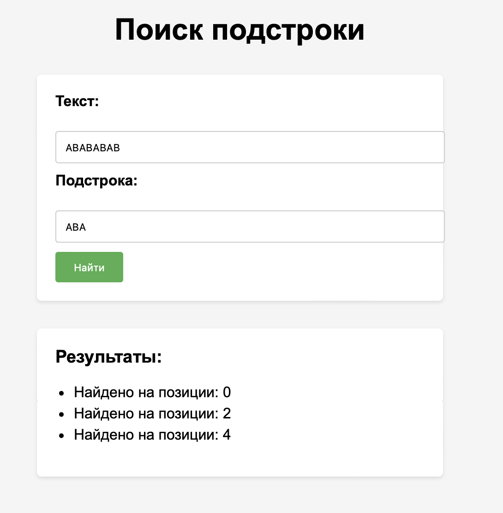

# Алгоритм Кнута-Морриса-Пратта (КМП)

## Описание

Алгоритм Кнута-Морриса-Пратта (КМП) - это эффективный алгоритм для поиска подстроки в строке. Он позволяет находить все вхождения заданной подстроки в тексте, выполняя это быстро и эффективно.

## Как работает КМП

Работа алгоритма КМП можно разделить на следующие шаги:

1. Инициализация таблицы префиксов (таблица "пи"): На этом этапе алгоритм создает таблицу префиксов для заданной подстроки (шаблона). Таблица "пи" указывает на наилучший сдвиг, который следует использовать в случае несовпадения символов.

2. Сравнение: Алгоритм сравнивает символы текста и шаблона поочередно, начиная с начала текста и шаблона. Если символы совпадают, алгоритм продвигается вперед в обоих строках. Если символы не совпадают, алгоритм использует таблицу "пи", чтобы определить наилучший сдвиг для шаблона.

3. Поиск: Алгоритм повторяет шаг 2 до тех пор, пока не найдет все вхождения шаблона в тексте.

## Пример

Представим, что у нас есть текст "ABABABAB" и мы ищем подстроку "ABA" с использованием алгоритма КМП. Процесс может выглядеть следующим образом:

1. Инициализация таблицы "пи" для "ABA":
   - Позиция 1: 0 (нет совпадений префикса и суффикса)
   - Позиция 2: 0 (нет совпадений префикса и суффикса)
   - Позиция 3: 1 (префикс "A" совпадает с суффиксом "A")
   
2. Сравнение:
   - Сравниваем "A" (текст) с "A" (шаблон) - совпадение, продвигаемся вперед.
   - Сравниваем "B" (текст) с "B" (шаблон) - совпадение, продвигаемся вперед.
   - Сравниваем "A" (текст) с "A" (шаблон) - совпадение, продвигаемся вперед.
   - Сравниваем "B" (текст) с "A" (шаблон) - несовпадение.
     - Сдвигаем шаблон на 1 позицию с использованием таблицы "пи".
   - Сравниваем "A" (текст) с "A" (шаблон) - совпадение, продвигаемся вперед.
   - Сравниваем "B" (текст) с "B" (шаблон) - совпадение, продвигаемся вперед.
   - Сравниваем "A" (текст) с "A" (шаблон) - совпадение, продвигаемся вперед.
   - Сравниваем "B" (текст) с "A" (шаблон) - несовпадение.
     - Сдвигаем шаблон на 1 позицию с использованием таблицы "пи".
   - Сравниваем "A" (текст) с "A" (шаблон) - совпадение, продвигаемся вперед.

3. Поиск завершен. Мы нашли все вхождения подстроки "ABA" в тексте "ABABABAB".

## Пример использования

## Дополнительная информация

Для подробного понимания и реализации алгоритма КМП в вашем коде, рекомендуется изучить соответствующую литературу и ресурсы.

## Лицензия

Этот проект распространяется под лицензией NUST MISIS.
